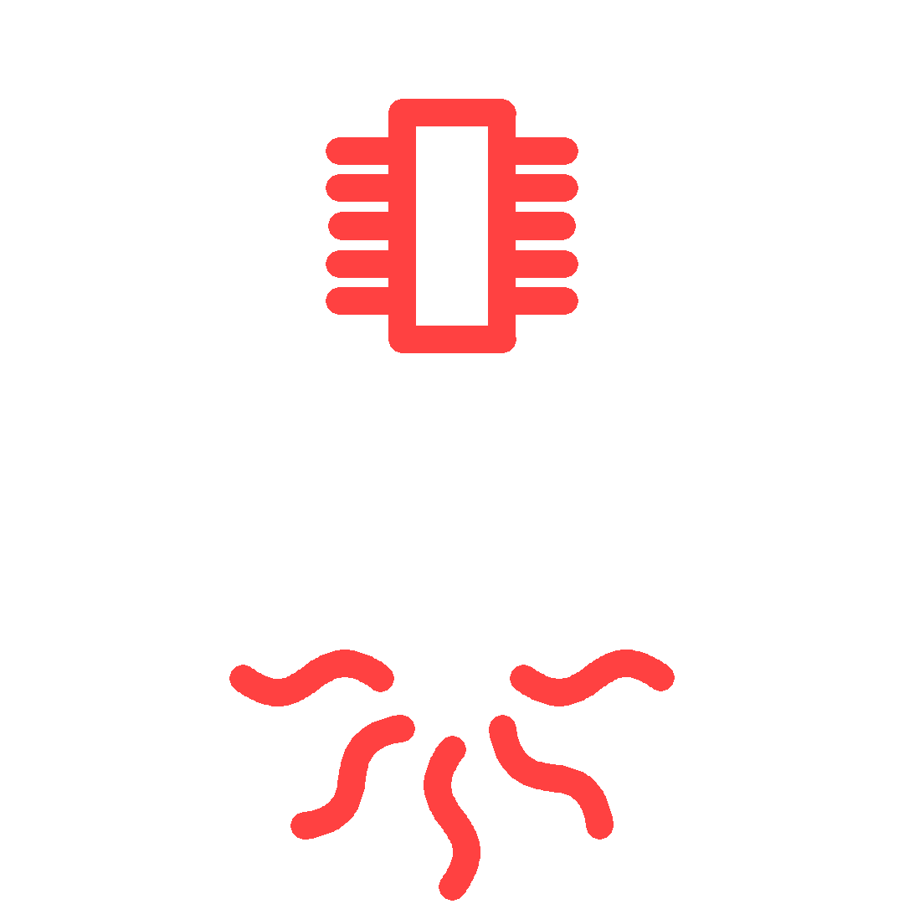

<h3 align="center">ESP32-S2 Based Thermocouple Dirver</h3>

### Materials

* ESP32-S2
* LM356
* AD620AN
* ~~LM35~~
* [TC33X-2-103E](https://componentsearchengine.com/part-view/TC33X-2-103E/Bourns) (or equivalent footprint)

### Proyect Structure

**IDF code**
FLAGS: 
 * TEST (breadboard/PCB)
 * DEBUG (SERIAL OUTPUT)

**Kicad**

> The last version is made for a 1-wire temperature module, the PCB can include LM35/LM335 like the example in [Commit 6ab5541](https://github.com/jackestar/esp32-thermocouple/commit/6ab55410f83fd76fe158129e17a911ef169d20fd) 
